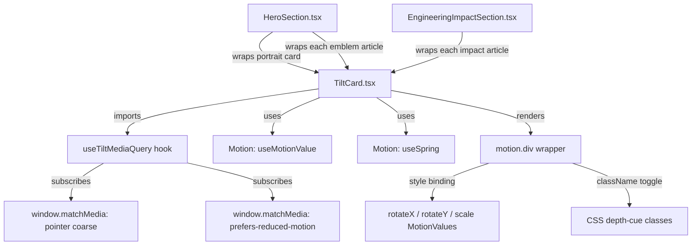

# Design Document: Portfolio Card Tilt

## Overview

The `TiltCard` feature adds a Motion-driven 3D pointer-tracking tilt interaction to selected card components: the hero portrait card, achievement emblem cards, and engineering impact cards. The interaction is designed to feel tactile and premium — like illustrated objects sitting on a sketch board — consistent with the site's editorial monochrome visual direction.

The tilt system wraps existing card markup with a single reusable `TiltCard` component that uses Motion's `useMotionValue` and `useSpring` primitives to drive `rotateX`, `rotateY`, and `scale` transforms in response to fine-pointer cursor position, without triggering React re-renders on every pointer-move event.

Behavioral correctness is maintained for all users: `prefers-reduced-motion` disables rotation and scale at the JS subscription level; coarse/touch input skips listener registration entirely; keyboard focus receives no tilt and no interference with natural tab order.

### Key Design Decisions

- **Motion library only**: Motion (`motion` ≥ 11.0.0) is the sole animation dependency added. It ships a stable spring primitive API (`useMotionValue`, `useSpring`, `motion.div`) that runs transforms off the React render cycle.
- **No React state on pointer move**: The hot path uses Motion value mutation only, keeping pointer-move handlers at O(1) with no virtual DOM work.
- **Per-event `getBoundingClientRect`**: Layout reads happen on pointer events (not stored on mount) to keep the transform calculation correct after scroll or layout shifts.
- **CSS transitions only for depth cues**: Shadow and border hover effects use CSS class toggling with `transition` so they remain outside the JS animation cycle and automatically respect `prefers-reduced-motion: reduce` at the CSS layer as a complementary guard.
- **Shared spring config**: A single exported `SPRING_CONFIG` constant is consumed by all card instantiations to ensure consistent motion feel across card types.

---

## Architecture

The Tilt_System is a single-component feature with one supporting hook for media-query subscriptions. No new contexts, providers, or state managers are introduced.



### Component Boundaries

| Unit | Responsibility |
|---|---|
| `TiltCard` | Wrapper component; owns spring values, event handlers, depth-cue class state |
| `useTiltMediaQuery` | Subscribes to a `MediaQueryList` and returns live boolean state with proper cleanup |
| `SPRING_CONFIG` | Exported constant; shared stiffness/damping/mass values |
| Section components | Pass `maxTilt`/`scaleFactor` props; do not own animation logic |

---

## Components and Interfaces

### `TiltCard` Component

**File**: `src/components/ui/TiltCard.tsx`

```typescript
export interface TiltCardProps {
  children: React.ReactNode
  className?: string
  /** Maximum rotation in degrees. Range: 0–45. Default: 8 */
  maxTilt?: number
  /** Scale factor on hover. Range: 1.0–2.0 (effective max capped at 1.04 by requirement). Default: 1.02 */
  scaleFactor?: number
}
```

The component renders a `motion.div` as a transparent wrapper. It does not apply any background, padding, border-radius, or layout class of its own — those remain on the wrapped child element to preserve the existing sketch-surface visual structure.

**Rendering strategy**:
- `motion.div` receives `style={{ rotateX, rotateY, scale }}` bindings to the spring MotionValues.
- `transform-style: preserve-3d` is set on the wrapper via inline style only (not cascaded).
- `will-change: transform` is applied inline.
- Hover depth cues are applied via a CSS class toggled through a single `isHovered` boolean React state (set on `pointerenter`/`pointerleave`). This state change is acceptable because it happens at pointer enter/leave granularity (max 2 re-renders per hover cycle), not on every pointer-move.

**Event handler logic**:

```
onPointerEnter:
  if (isCoarse || isReducedMotion) return
  setIsHovered(true)
  // spring values begin tracking from pointer-move

onPointerMove:
  if (isCoarse || isReducedMotion) return
  const rect = ref.getBoundingClientRect()
  if (rect.width === 0 || rect.height === 0) return
  const normX = (e.clientX - rect.left - rect.width / 2) / (rect.width / 2)
  const normY = (e.clientY - rect.top - rect.height / 2) / (rect.height / 2)
  rotateYValue.set(clamp(normX * maxTilt, -maxTilt, maxTilt))
  rotateXValue.set(clamp(-normY * maxTilt, -maxTilt, maxTilt))

onPointerLeave:
  setIsHovered(false)
  rotateYValue.set(0)
  rotateXValue.set(0)
  scaleValue.set(1)
```

Note: `scale` is set to `scaleFactor` on enter and back to `1` on leave via direct `MotionValue.set()` calls — the spring wrapping the scale value handles easing.

### `useTiltMediaQuery` Hook

**File**: Internal to `TiltCard.tsx` (unexported, co-located).

```typescript
function useTiltMediaQuery(query: string): boolean
```

Uses `useState` (initialized with `window.matchMedia(query).matches`) and `useEffect` to subscribe to `MediaQueryList.addEventListener('change', handler)`, updating the boolean on change. Cleans up the listener on unmount. Returns the current match state.

Called twice in `TiltCard`:
1. `const isCoarse = useTiltMediaQuery('(pointer: coarse)')`
2. `const isReducedMotion = useTiltMediaQuery('(prefers-reduced-motion: reduce)')`

### `SPRING_CONFIG` Constant

```typescript
export const SPRING_CONFIG = {
  stiffness: 260,
  damping: 28,
  mass: 0.8,
} as const
```

Stiffness 260 (≤ 300 ✓), damping 28 (≥ 20 ✓), mass 0.8 (≤ 1 ✓). These values produce a snappy entry with a slight natural overshoot decay, completing within roughly 300–450 ms, satisfying the 50–600 ms window in Requirement 2.8.

---

## Data Models

No persistent data structures are introduced. All state is ephemeral and component-local.

### Runtime State

| State | Type | Location | Notes |
|---|---|---|---|
| `rotateXValue` | `MotionValue<number>` | component | Driven by pointer Y offset |
| `rotateYValue` | `MotionValue<number>` | component | Driven by pointer X offset |
| `scaleValue` | `MotionValue<number>` | component | Driven by enter/leave |
| `rotateX` | `SpringValue` (wraps `rotateXValue`) | component | Consumed by `motion.div` style |
| `rotateY` | `SpringValue` (wraps `rotateYValue`) | component | Consumed by `motion.div` style |
| `scale` | `SpringValue` (wraps `scaleValue`) | component | Consumed by `motion.div` style |
| `isHovered` | `boolean` React state | component | Toggles depth-cue CSS class |
| `isCoarse` | `boolean` | hook | `(pointer: coarse)` subscription |
| `isReducedMotion` | `boolean` | hook | `(prefers-reduced-motion: reduce)` subscription |

### CSS Depth Cue Classes

Two CSS classes are added to `globals.css`:

```css
/* Resting state — depth-cue layer is inert */
.tilt-depth-idle { /* no additional properties needed; existing sketch classes provide resting shadow */ }

/* Active hover depth cue */
.tilt-depth-active {
  box-shadow:
    var(--ds-shadow-card),
    0 28px 56px rgba(0, 0, 0, 0.48),
    0 8px 16px rgba(0, 0, 0, 0.32);
  border-color: rgba(200, 166, 107, 0.4); /* var(--ds-accent) at 0.4 opacity */
  transition:
    box-shadow 160ms ease,
    border-color 160ms ease;
}
```

The `transition` on `.tilt-depth-active` also runs on the return path (when the class is removed), achieving the ≤ 200 ms enter/exit requirement. The `motion.div` wrapper itself carries no border or shadow — those remain on the child element via the `className` prop passthrough.

**Implementation note**: Because `motion.div` is the wrapper and the sketch classes are on the child element, the depth-cue class must be applied to a forwarded `className` on the wrapper such that children inherit, or alternatively the shadow/border class can be applied to the wrapper and the child's own border is suppressed. The cleaner approach: the depth-cue class is added to the `motion.div` wrapper directly, and the wrapper receives a `border` style from the parent-provided `className`. Since `TiltCard` is transparent by design, the `tilt-depth-active` class is added to the wrapper and the implementer should ensure the wrapper has `border: 1px solid transparent` in resting state to allow the color transition to work without layout shift.

Alternatively — and more practically — the `isHovered` state is passed via a data attribute (`data-tilt-active`) and the depth cue targets `[data-tilt-active="true"]` in CSS. This is the chosen approach, as it avoids adding inline borders to the wrapper that could conflict with child border styles.

---

## Correctness Properties

*A property is a characteristic or behavior that should hold true across all valid executions of a system — essentially, a formal statement about what the system should do. Properties serve as the bridge between human-readable specifications and machine-verifiable correctness guarantees.*

### Property 1: Pointer-offset normalization is bounded

*For any* card bounding box with non-zero dimensions and any pointer position, the normalized X and Y offsets produced by the tilt calculation SHALL both fall within the closed interval `[−1, +1]`.

**Validates: Requirements 4.1, 4.3**

---

### Property 2: Tilt rotation is bounded by maxTilt

*For any* value of `maxTilt` in the valid range `[0, 45]` and any pointer position within or outside the card bounds, the `rotateX` and `rotateY` MotionValues set by `onPointerMove` SHALL each be within `[−maxTilt, +maxTilt]` degrees.

**Validates: Requirements 4.3**

---

### Property 3: Reduced-motion suppresses all transform outputs

*For any* pointer position and any `maxTilt` value, when `prefers-reduced-motion: reduce` is active, the `rotateX`, `rotateY`, and `scale` spring values driven by `TiltCard` SHALL equal `0`, `0`, and `1` respectively at all times during and after pointer interaction.

**Validates: Requirements 9.1, 9.2**

---

### Property 4: Coarse-pointer suppresses all transform outputs

*For any* pointer event, when `(pointer: coarse)` matches, the `rotateX`, `rotateY`, and `scale` spring values driven by `TiltCard` SHALL equal `0`, `0`, and `1` respectively, and no pointer-move listener SHALL be registered.

**Validates: Requirements 10.1, 10.2**

---

### Property 5: Zero-dimension guard prevents NaN

*For any* call to the `onPointerMove` handler when `getBoundingClientRect` returns a width or height of zero, the tilt calculation SHALL exit early and the current `rotateX` and `rotateY` MotionValues SHALL remain unchanged (no NaN, no error).

**Validates: Requirements 4.5**

---

### Property 6: Reset on pointer leave

*For any* TiltCard in any tilted state, after a `pointerleave` event, the target values of `rotateX`, `rotateY`, and `scale` SHALL be set to `0`, `0`, and `1` respectively, regardless of the tilt values at leave time.

**Validates: Requirements 2.7**

---

### Property 7: Scale factor is clamped to safe maximum

*For any* `scaleFactor` prop value passed to `TiltCard`, the scale MotionValue set on hover SHALL never exceed `1.04`, satisfying the hard cap from Requirement 5.6.

**Validates: Requirements 5.6**

---

## Error Handling

### Zero-Dimension Guard

If `getBoundingClientRect` returns `width === 0` or `height === 0` (e.g., during a display-none transition or early render), the pointer-move handler returns early with no computation. This prevents division by zero producing `NaN` or `Infinity` in the rotation values, which would produce a broken CSS transform.

### Media Query Unavailability

In environments where `window.matchMedia` is undefined (SSR, certain test environments), the `useTiltMediaQuery` hook must guard with `typeof window !== 'undefined' && typeof window.matchMedia === 'function'`. For this project (static SPA with no SSR), the practical risk is low but the guard is included for correctness.

### Prop Range Violations

`maxTilt` values outside `[0, 45]` and `scaleFactor` values outside `[1.0, 2.0]` should be clamped internally rather than trusted. Additionally `scaleFactor` must be clamped to `1.04` as the hard cap from Requirement 5.6 supersedes the prop range.

```typescript
const clampedMaxTilt = Math.max(0, Math.min(45, maxTilt ?? 8))
const clampedScale = Math.max(1.0, Math.min(1.04, scaleFactor ?? 1.02))
```

### Event Listener Cleanup

The `useTiltMediaQuery` hook's `useEffect` returns a cleanup function that removes the `change` event listener. This prevents memory leaks and stale-closure bugs when the component unmounts.

---

## Testing Strategy

Property-based testing is applicable to this feature for the pure computation layer (pointer normalization, clamping, and guard logic). The Motion spring animation and DOM interaction layers are tested with example-based and integration approaches.

### Property-Based Tests

Use [fast-check](https://fast-check.dev/) (TypeScript-native PBT library) for the following properties. Each test runs a minimum of 100 iterations.

**Target file**: `src/components/ui/TiltCard.test.ts`

**Property 1** — Normalization bounds:
Generate arbitrary `clientX`, `clientY`, and `DOMRect` values with non-zero width/height. Assert normalized X and Y are each within `[−1, +1]`.
*Feature: portfolio-card-tilt, Property 1: pointer-offset normalization is bounded*

**Property 2** — Rotation clamping:
Generate arbitrary `maxTilt` in `[0, 45]`, arbitrary normalized offsets. Assert computed rotation values are each within `[−maxTilt, +maxTilt]`.
*Feature: portfolio-card-tilt, Property 2: tilt rotation is bounded by maxTilt*

**Property 3** — Reduced-motion suppression:
Generate arbitrary pointer events. Assert that with `isReducedMotion = true`, `computeTilt` returns `{ rotateX: 0, rotateY: 0, scale: 1 }`.
*Feature: portfolio-card-tilt, Property 3: reduced-motion suppresses all transform outputs*

**Property 4** — Coarse pointer suppression:
Generate arbitrary pointer events. Assert that with `isCoarse = true`, `computeTilt` returns `{ rotateX: 0, rotateY: 0, scale: 1 }`.
*Feature: portfolio-card-tilt, Property 4: coarse-pointer suppresses all transform outputs*

**Property 5** — Zero-dimension guard:
Generate pointer events with `rect.width = 0` or `rect.height = 0`. Assert no NaN or Infinity in outputs and existing values are preserved.
*Feature: portfolio-card-tilt, Property 5: zero-dimension guard prevents NaN*

**Property 7** — Scale cap:
Generate arbitrary `scaleFactor` in `[1.0, 2.0]`. Assert the clamped internal scale value never exceeds `1.04`.
*Feature: portfolio-card-tilt, Property 7: scale factor is clamped to safe maximum*

**Implementation note**: Extract the pure calculation logic into a standalone `computeTiltTransform` function that can be unit/property-tested without DOM or Motion dependencies:

```typescript
// Exported for testing
export function computeTiltTransform(
  event: { clientX: number; clientY: number },
  rect: { left: number; top: number; width: number; height: number },
  maxTilt: number,
  scaleFactor: number,
  isCoarse: boolean,
  isReducedMotion: boolean
): { rotateX: number; rotateY: number; scale: number }
```

**Property 6** — Reset on leave is an identity property (output is always the same constant regardless of input), so it is better tested as a targeted example test than a property test.

### Unit / Example-Based Tests

- `TiltCard` renders children without modifying their structure (snapshot).
- Pointer-leave resets all transform targets to identity values.
- `useTiltMediaQuery` returns initial value synchronously and updates on `change` event.
- `TiltCard` with `maxTilt={6}` applies no more than 6° rotation under any pointer position.

### Visual / Manual Integration Tests

- Hero portrait card: verify tilt activates on desktop, is absent on mobile, and that the portrait image dimensions and emblem grid position are unchanged.
- Emblem cards: verify independent per-card tilt with no cross-card interference.
- Impact cards: verify links inside cards remain clickable during and after tilt.
- Reduced motion: verify no rotation or scale appears when OS preference is set.
- `npm run lint` and `npm run build` must exit with zero errors.
